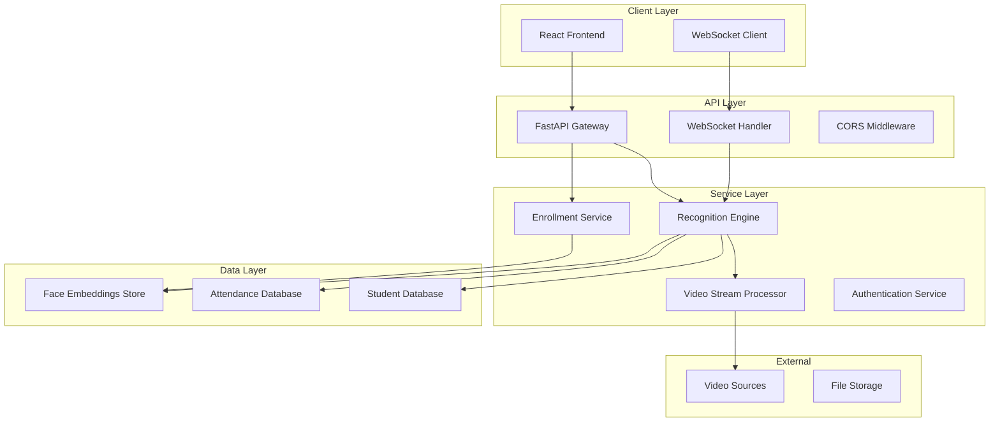

# Design Document: Face Recognition Backend System

## Overview

The Face Recognition Backend System is a Python-based microservice that provides real-time facial recognition capabilities for an attendance monitoring dashboard. The system leverages OpenCV for face detection and dlib for face recognition, generating 128-dimensional face embeddings on a unit hypersphere for robust identity matching.

The architecture follows a modular design with clear separation between video processing, face recognition, API services, and data persistence layers. The system supports real-time video stream processing, WebSocket communication for live updates, and RESTful APIs for frontend integration.

## Architecture

The system follows a layered architecture with the following key components:



## Components and Interfaces

### 1. FastAPI Gateway
**Purpose**: Main API entry point providing RESTful endpoints for frontend communication.

**Key Interfaces**:
- `POST /api/students` - Student enrollment
- `GET /api/students` - Retrieve student list
- `GET /api/attendance` - Attendance records retrieval
- `POST /api/recognition/start` - Start recognition session
- `GET /api/recognition/status` - Recognition status
- `GET /health` - Health check endpoint

**Dependencies**: Authentication Service, Recognition Engine, Enrollment Service

### 2. WebSocket Handler
**Purpose**: Manages real-time communication with frontend clients for live updates.

**Key Interfaces**:
- `connect()` - Establish WebSocket connection
- `disconnect()` - Handle connection cleanup
- `broadcast_recognition(student_id, confidence)` - Send recognition events
- `broadcast_attendance(attendance_record)` - Send attendance updates
- `heartbeat()` - Connection health monitoring

**Dependencies**: Recognition Engine, Attendance Database

### 3. Recognition Engine
**Purpose**: Core face recognition logic using OpenCV and dlib.

**Key Methods**:
```python
class RecognitionEngine:
    def detect_faces(self, frame: np.ndarray) -> List[BoundingBox]
    def extract_embedding(self, face_image: np.ndarray) -> np.ndarray
    def compare_embeddings(self, embedding1: np.ndarray, embedding2: np.ndarray) -> float
    def recognize_face(self, frame: np.ndarray) -> Optional[RecognitionResult]
    def load_known_faces(self) -> Dict[str, np.ndarray]
```

**Configuration**:
- Recognition threshold: 0.6 (cosine similarity)
- Face detection model: dlib's HOG + Linear SVM
- Face recognition model: dlib's ResNet-based face recognition model
- Embedding dimensions: 128

### 4. Video Stream Processor
**Purpose**: Handles video input from various sources and frame processing.

**Key Methods**:
```python
class VideoStreamProcessor:
    def initialize_camera(self, source: Union[int, str]) -> bool
    def read_frame(self) -> Optional[np.ndarray]
    def process_frame_queue(self) -> None
    def release_resources(self) -> None
```

**Supported Sources**:
- Webcam (device index)
- IP cameras (RTSP streams)
- Video files (MP4, AVI)

### 5. Enrollment Service
**Purpose**: Manages student registration and face model training.

**Key Methods**:
```python
class EnrollmentService:
    def enroll_student(self, student_data: StudentData, face_images: List[np.ndarray]) -> str
    def extract_multiple_embeddings(self, face_images: List[np.ndarray]) -> List[np.ndarray]
    def validate_face_quality(self, face_image: np.ndarray) -> bool
    def update_student_embeddings(self, student_id: str, new_embeddings: List[np.ndarray]) -> bool
```

### 6. Authentication Service
**Purpose**: Handles API authentication and authorization.

**Key Methods**:
```python
class AuthenticationService:
    def generate_jwt_token(self, user_data: dict) -> str
    def validate_token(self, token: str) -> Optional[dict]
    def check_permissions(self, user_id: str, resource: str) -> bool
```

## Data Models

### Student Model
```python
@dataclass
class Student:
    id: str
    name: str
    email: str
    student_number: str
    created_at: datetime
    updated_at: datetime
    is_active: bool
    face_embeddings: List[bytes]  # Serialized numpy arrays
```

### Attendance Record Model
```python
@dataclass
class AttendanceRecord:
    id: str
    student_id: str
    timestamp: datetime
    confidence_score: float
    location: str
    session_id: str
    image_path: Optional[str]
```

### Recognition Result Model
```python
@dataclass
class RecognitionResult:
    student_id: Optional[str]
    confidence: float
    bounding_box: BoundingBox
    embedding: np.ndarray
    timestamp: datetime
```

### Database Schema

**Students Table**:
```sql
CREATE TABLE students (
    id VARCHAR(36) PRIMARY KEY,
    name VARCHAR(255) NOT NULL,
    email VARCHAR(255) UNIQUE,
    student_number VARCHAR(50) UNIQUE,
    created_at TIMESTAMP DEFAULT CURRENT_TIMESTAMP,
    updated_at TIMESTAMP DEFAULT CURRENT_TIMESTAMP,
    is_active BOOLEAN DEFAULT TRUE
);
```

**Face Embeddings Table**:
```sql
CREATE TABLE face_embeddings (
    id VARCHAR(36) PRIMARY KEY,
    student_id VARCHAR(36) REFERENCES students(id),
    embedding BLOB NOT NULL,
    quality_score FLOAT,
    created_at TIMESTAMP DEFAULT CURRENT_TIMESTAMP
);
```

**Attendance Records Table**:
```sql
CREATE TABLE attendance_records (
    id VARCHAR(36) PRIMARY KEY,
    student_id VARCHAR(36) REFERENCES students(id),
    timestamp TIMESTAMP DEFAULT CURRENT_TIMESTAMP,
    confidence_score FLOAT NOT NULL,
    location VARCHAR(255),
    session_id VARCHAR(36),
    image_path VARCHAR(500)
);
```

## Correctness Properties

*A property is a characteristic or behavior that should hold true across all valid executions of a system—essentially, a formal statement about what the system should do. Properties serve as the bridge between human-readable specifications and machine-verifiable correctness guarantees.*

### Property 1: Face Embedding Generation Consistency
*For any* valid face image, the system should generate a 128-dimensional embedding vector that is normalized on the unit hypersphere (magnitude = 1.0)
**Validates: Requirements 1.1, 2.2**

### Property 2: Face Quality Validation
*For any* input image, if the face quality score is below the minimum threshold, the system should reject the image and provide a descriptive error message
**Validates: Requirements 1.4**

### Property 3: Data Persistence Integrity
*For any* student enrollment with face embeddings, storing the data should result in retrievable records that maintain referential integrity between students, embeddings, and attendance records
**Validates: Requirements 1.3, 5.1, 5.2, 5.3, 5.6**

### Property 4: Recognition Threshold Enforcement
*For any* face recognition attempt, attendance should only be recorded when the confidence score exceeds the configured threshold
**Validates: Requirements 2.5**

### Property 5: Cosine Similarity Calculation
*For any* two face embeddings, the comparison should use cosine similarity calculation on the unit hypersphere, returning values between -1 and 1
**Validates: Requirements 2.3**

### Property 6: Student Identification Accuracy
*For any* face that matches a stored embedding above the threshold, the system should correctly identify the student and return the appropriate confidence score
**Validates: Requirements 2.4**

### Property 7: Authentication Token Validation
*For any* API request, the system should validate JWT tokens and reject requests with invalid, expired, or missing tokens
**Validates: Requirements 3.4, 9.2**

### Property 8: CORS Header Inclusion
*For any* API response, the system should include proper CORS headers to enable frontend integration
**Validates: Requirements 3.5**

### Property 9: Consistent Error Response Format
*For any* error condition, the API should return JSON responses with consistent structure including error code, message, and timestamp
**Validates: Requirements 3.6**

### Property 10: WebSocket Event Broadcasting
*For any* recognition or attendance event, the system should broadcast the event to all connected WebSocket clients within 100ms
**Validates: Requirements 4.2, 4.3**

### Property 11: WebSocket Connection Health
*For any* established WebSocket connection, the system should send heartbeat messages at regular intervals and handle connection failures gracefully
**Validates: Requirements 4.4, 4.5**

### Property 12: Concurrent Connection Support
*For any* number of concurrent WebSocket connections up to the configured limit, the system should maintain all connections without degradation
**Validates: Requirements 4.6**

### Property 13: Database Retry Logic
*For any* database operation failure, the system should implement exponential backoff retry logic with a maximum number of attempts
**Validates: Requirements 5.4**

### Property 14: Multi-Database Compatibility
*For any* supported database type (SQLite, PostgreSQL), the system should provide identical functionality and data consistency
**Validates: Requirements 5.5**

### Property 15: Video Stream Processing
*For any* supported video source (webcam, RTSP, file), the system should successfully initialize the stream and read frames without memory leaks
**Validates: Requirements 6.1, 6.2, 6.3, 6.6**

### Property 16: Frame Buffer Management
*For any* video stream processing session, the system should maintain bounded memory usage through proper frame buffering
**Validates: Requirements 6.4**

### Property 17: Adaptive Threshold Adjustment
*For any* video stream with varying quality, the system should dynamically adjust recognition thresholds to maintain accuracy
**Validates: Requirements 6.5**

### Property 18: Environment Configuration
*For any* environment variable change, the system should use the new configuration values without requiring a restart
**Validates: Requirements 7.2, 7.6**

### Property 19: Graceful Shutdown
*For any* shutdown signal received, the system should complete ongoing operations and release resources cleanly
**Validates: Requirements 7.4**

### Property 20: Request Queuing Under Load
*For any* system load condition, incoming requests should be queued and processed in order without loss
**Validates: Requirements 8.3**

### Property 21: Structured Logging
*For any* recognition event or system operation, the system should generate structured logs with consistent format and required fields
**Validates: Requirements 8.4**

### Property 22: Detailed Error Messages
*For any* error condition, the system should provide detailed error messages with specific recovery suggestions
**Validates: Requirements 8.5**

### Property 23: API Rate Limiting
*For any* client making API requests, the system should enforce rate limits and return appropriate HTTP status codes when limits are exceeded
**Validates: Requirements 8.6**

### Property 24: Data Encryption at Rest
*For any* face embedding stored in the database, the data should be encrypted using AES-256 encryption
**Validates: Requirements 9.1**

### Property 25: Secure Protocol Usage
*For any* data transmission, the system should use HTTPS for API calls and WSS for WebSocket connections
**Validates: Requirements 9.3**

### Property 26: Audit Trail Logging
*For any* system access or operation, the system should generate audit logs with user identification, timestamp, and action details
**Validates: Requirements 9.4**

### Property 27: Data Retention Compliance
*For any* stored biometric data, the system should enforce configured retention policies and automatically purge expired data
**Validates: Requirements 9.5**

### Property 28: GDPR Data Deletion
*For any* data deletion request, the system should completely remove all associated student data, embeddings, and attendance records
**Validates: Requirements 9.6**

## Error Handling

The system implements comprehensive error handling across all layers:

### API Layer Errors
- **400 Bad Request**: Invalid input data, malformed requests
- **401 Unauthorized**: Missing or invalid authentication tokens
- **403 Forbidden**: Insufficient permissions for requested operation
- **404 Not Found**: Requested resource does not exist
- **429 Too Many Requests**: Rate limit exceeded
- **500 Internal Server Error**: Unexpected system errors

### Recognition Engine Errors
- **Face Detection Failures**: No faces detected in frame
- **Poor Image Quality**: Image quality below acceptable threshold
- **Embedding Generation Errors**: Failed to generate face embeddings
- **Recognition Timeouts**: Processing time exceeded limits

### Database Errors
- **Connection Failures**: Database unavailable or connection lost
- **Constraint Violations**: Unique key or foreign key violations
- **Transaction Failures**: Rollback on data consistency errors
- **Storage Limits**: Disk space or record count limits exceeded

### Video Processing Errors
- **Stream Initialization**: Camera or stream source unavailable
- **Frame Reading Errors**: Corrupted or unreadable video frames
- **Memory Overflow**: Insufficient memory for frame processing
- **Format Unsupported**: Video format not supported

## Testing Strategy

The system employs a dual testing approach combining unit tests and property-based tests for comprehensive coverage:

### Unit Testing
Unit tests focus on specific examples, edge cases, and integration points:
- **API endpoint functionality** with specific request/response examples
- **Database operations** with known data sets
- **Error condition handling** with simulated failures
- **Integration between components** with controlled scenarios

### Property-Based Testing
Property-based tests verify universal properties across randomized inputs using **Hypothesis** (Python property-based testing library):
- **Minimum 100 iterations** per property test to ensure comprehensive coverage
- **Random input generation** for face images, embeddings, and API requests
- **Invariant verification** across all valid input combinations
- **Edge case discovery** through automated input exploration

Each property-based test is tagged with: **Feature: face-recognition-backend, Property {number}: {property_text}**

### Test Configuration
```python
# Property-based test configuration
@given(face_image=face_image_strategy())
@settings(max_examples=100, deadline=5000)
def test_embedding_generation_consistency(face_image):
    """Feature: face-recognition-backend, Property 1: Face Embedding Generation Consistency"""
    embedding = recognition_engine.extract_embedding(face_image)
    assert len(embedding) == 128
    assert abs(np.linalg.norm(embedding) - 1.0) < 1e-6
```

### Testing Priorities
1. **Core recognition functionality** - Properties 1, 5, 6 (highest priority)
2. **Data integrity and persistence** - Properties 3, 13, 14
3. **API and communication** - Properties 7, 8, 9, 10
4. **Security and compliance** - Properties 24, 25, 26, 28
5. **Performance and reliability** - Properties 16, 20, 22

The combination of unit tests and property-based tests ensures both concrete behavior validation and universal correctness guarantees across the entire input space.